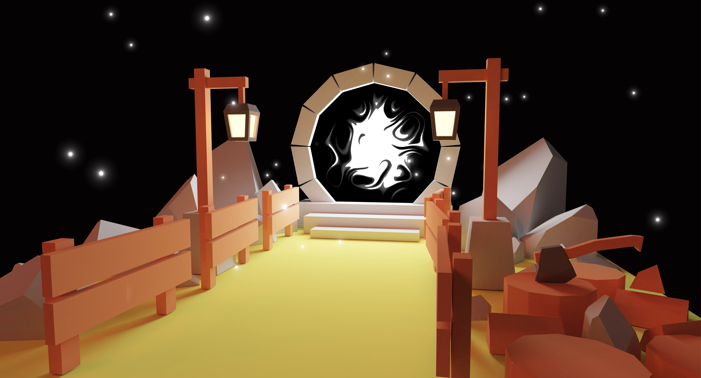

# Model Animations

This project explores writing custom animated shaders, building a scene in blender, baking lighting, and loading the scene in Three.js. The project also makes use of React Three Fiber.

The shader work is highlighted in the glowing and shifting patterns within the portal's stone circle. The scene features a low-poly 3D scene of a lantern-lit, fenced pathway leading through rocks and tree stumps to a mysterious stone portal. An axe rests in one of the stumps, and fireflies float against a black sky.

The work was undertaken as one of many steps in acquiring [my Three.js certification](https://threejs-journey.com/certificate/view/24741) through [Three.js Journey](https://threejs-journey.com/).

## Live demo

A running demo of the project can be viewed at https://dvdjrnx.github.io/portal-scene.

## Local development

### Installation

1. Clone the repository.
2. Install the required dependencies by running `npm install`.

### Usage

To start the project, run the following command:

`npm run dev`
